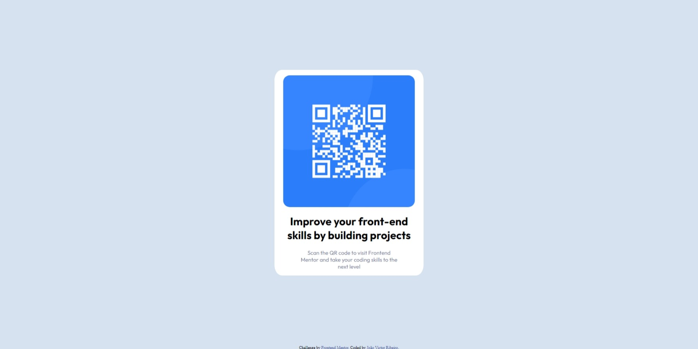

# Frontend Mentor - QR code component solution

This is a solution to the [QR code component challenge on Frontend Mentor](https://www.frontendmentor.io/challenges/qr-code-component-iux_sIO_H). Frontend Mentor challenges help you improve your coding skills by building realistic projects. 

## Table of contents

- [Overview](#overview)
  - [Screenshot](#screenshot)
  - [Links](#links)
- [My process](#my-process)
  - [Built with](#built-with)
  - [What I learned](#what-i-learned)
- [Author](#author)
- [Acknowledgments](#acknowledgments)

## Overview

### Screenshot



### Links

- Live Site URL: (https://tourmaline-caramel-088140.netlify.app/)

## My process

### Built with

- Semantic HTML5 markup
- CSS custom properties

### What I learned

I used this project to remember html and css, it was really good to remeber centering objects and texts.

```css
body { 
    display: flex;
    align-items: center;
    justify-content: center;
    text-align: center;
}
```

## Author

- Website - [João Victor Ribeiro](https://github.com/jvictorribeiro)
- Frontend Mentor - [@yourusername](https://www.frontendmentor.io/profile/yourusername)
